# 🛒 E-commerce Platform CI/CD Pipeline

## 📌 Introduction

This is a full-stack web application designed for seamless online shopping. This platform features user authentication, product listings, cart functionality, and order management.

This project follows a DevOps-oriented approach, integrating GitHub Actions, Docker, and AWS EC2 for automated deployment and scalability.

## 🎯 Project Overview
The E-commerce Platform consists of a React.js frontend and a Node.js/Express.js backend. The project is deployed on AWS EC2 with CI/CD automation using GitHub Actions. 

The goal is to automate the integration and deployment process for both components using Github Actions, ensuring continous delivery and integration.

## 🛠 Step-by-Step Method

## 📌 Step 1️⃣:Set Up Your GitHub Repository
1. Go to GitHub and create a new repository named ecommerce-platform

2. Clone the repository to your local machine:

```
git clone https://github.com/Joy-it-code/ecommerce-platform.git
cd ecommerce-platform
```

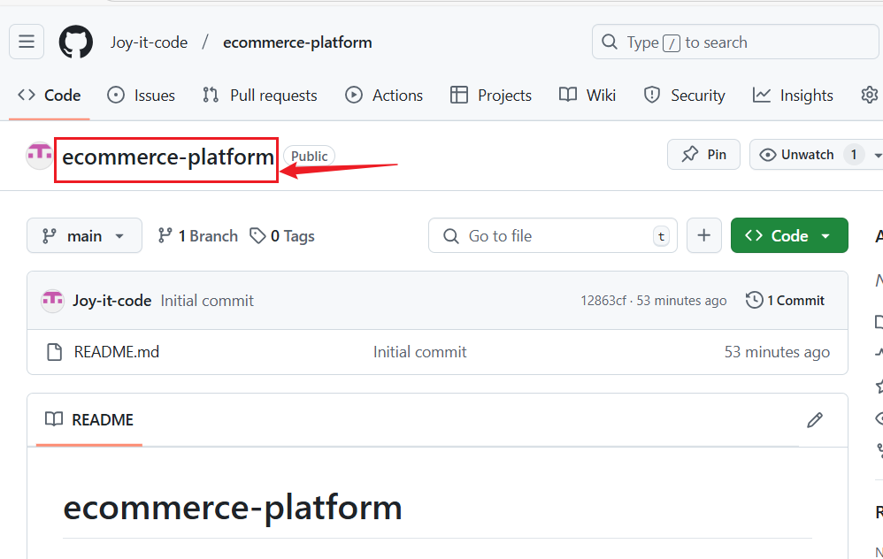
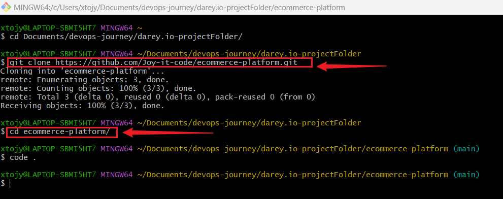

## 📌 Step 1️⃣.2️⃣:  Initialize Project Structure
1. Inside the repository, create directories for the backend and frontend: 
```
mkdir api webapp
```
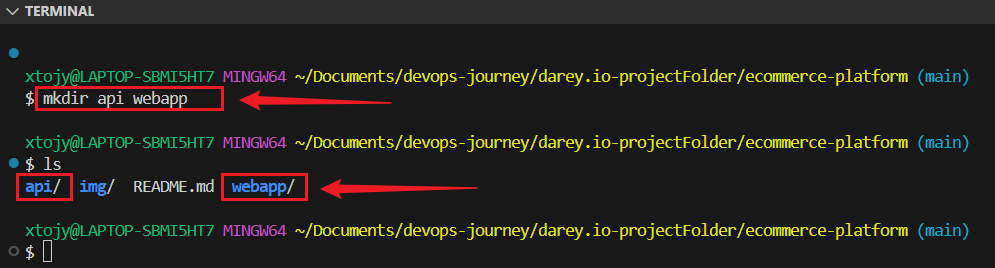

2. Navigate to the backend folder and initialize a Node.js project:

```
cd api
npm init -y
```
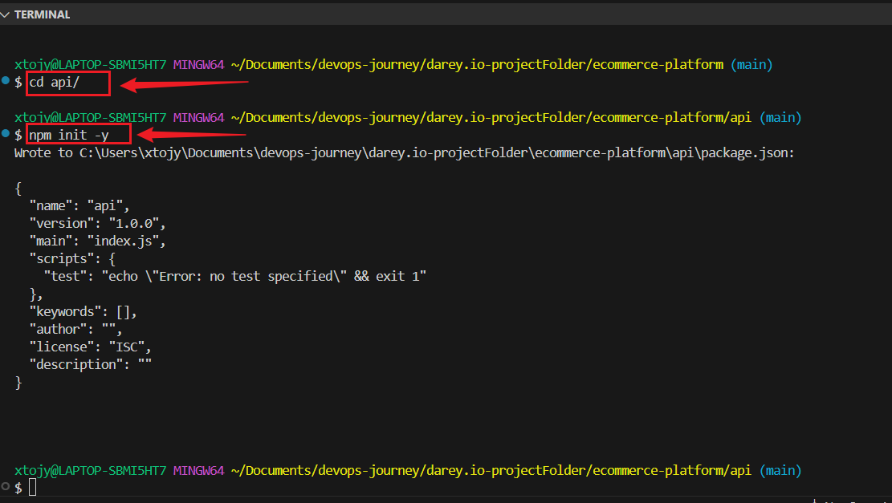
Backend api 🌍 runs on: http://localhost:5000

3. Navigate to the frontend folder and create a React app:
```
cd ../webapp
npx create-react-app .
```
[](./img/1e.cd.web.png)
Frontend webapp 🌍 runs on: http://localhost:3000

## 📌 Step 2️⃣: Initialize GitHub Actions
2.1 Set Up GitHub Actions Directory

1. Inside the repository, create a .github/workflows directory:
```
mkdir -p .github/workflows
```
2. Create an empty workflow file for CI/CD:
```
touch .github/workflows/ci.yml
```
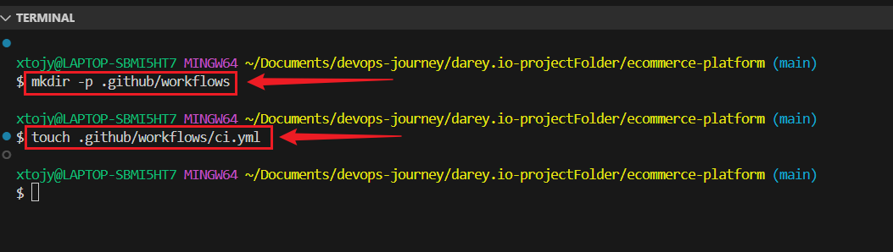

## 🖥 Step 3️⃣: Backend API Setup
+ **3.1: Install Dependencies**

1. Inside the api folder, install Express:
```
npm install express
npm install jest
```
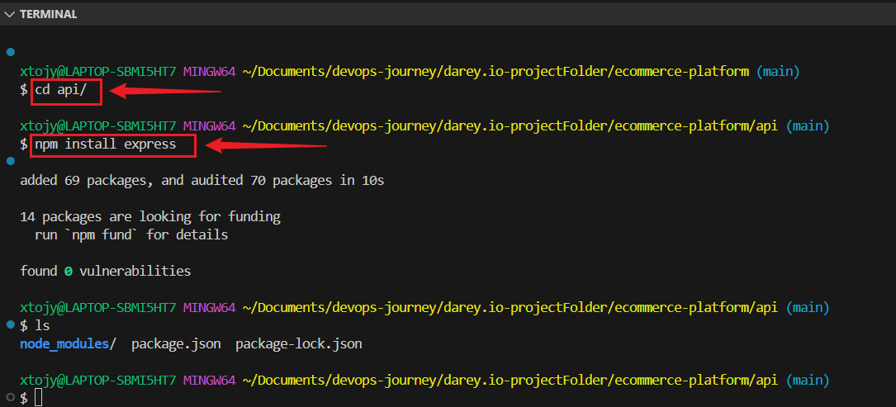

2. Create an index.js file and add the following:

```
nano index.js
```
```
const express = require('express');

const app = express();
const PORT = process.env.PORT || 5000;

app.get('/', (req, res) => {
    res.send('E-commerce API is running...');
});

// Only start the server if the file is run directly, not during tests
if (require.main === module) {
    app.listen(PORT, () => {
        console.log(`Server running on port ${PORT}`);
    });
}

module.exports = app; // Export app for testing
```

3. Run the API locally:
```
node index.js
```
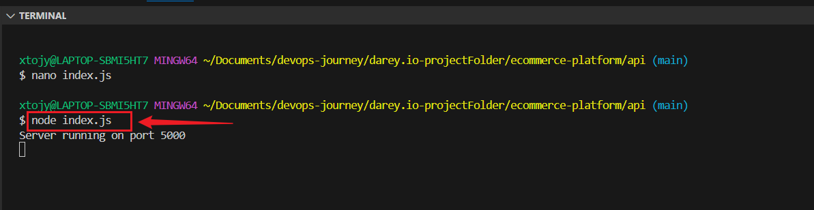

## 📌 Step 3️⃣.2️⃣: Implement Unit Tests For API

1. Install Jest and Supertest:
```
npm install --save-dev jest supertest
```
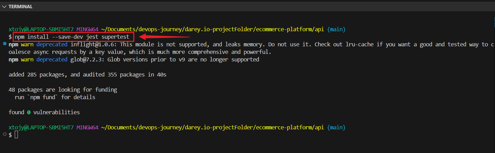

2. Add test scripts in package.json:
```
"scripts": {
    "test": "jest --detectOpenHandles --forceExit --runInBand"
}
```

3. Create a test folder and add a test file (api.test.js):

```
mkdir test
touch test/api.test.js
```
```
const request = require('supertest');
const app = require('../index'); // Import app without starting the server

describe('API Tests', () => {
    it('GET / should return API message', async () => {
        const response = await request(app).get('/');
        expect(response.statusCode).toBe(200);
        expect(response.text).toBe('E-commerce API is running...');
    });
});
```

## 4. ✅ Running Tests 🧪:

+ **Install new dependencies:**
```
npm install
```
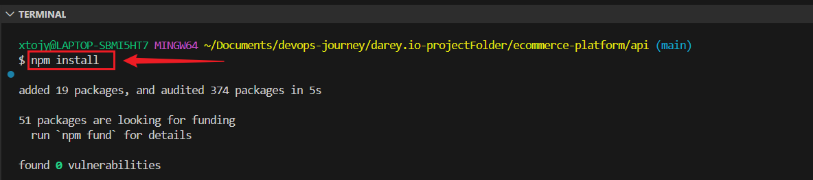

+  Run the server in development mode:
```
npm run dev
 ```
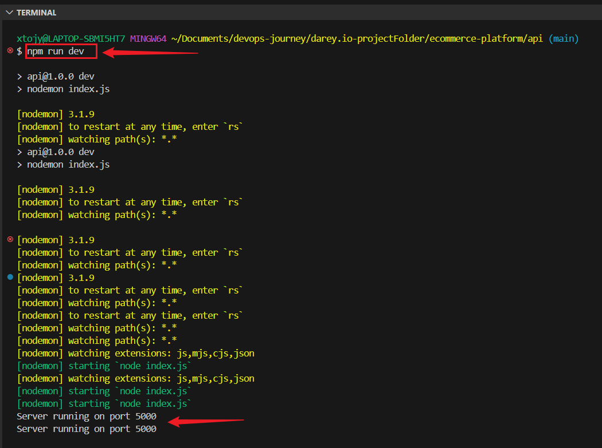

+ ✅ Run tests 🧪:
```
npm test
```
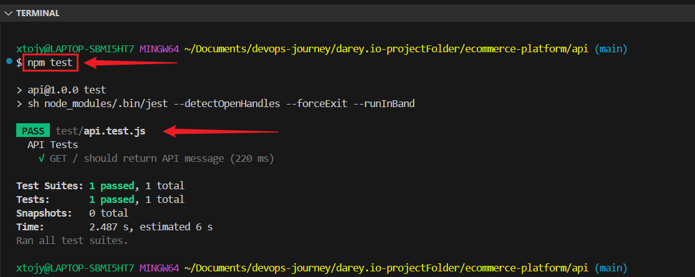

+ Run on browser: 
```
http://localhost:5000
```
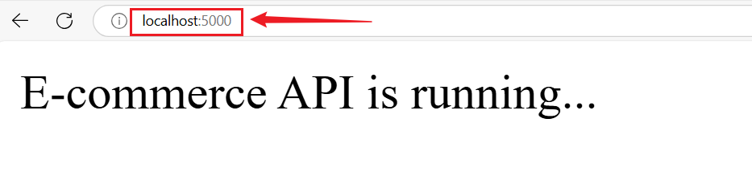

## 💻 Step 4️⃣: Frontend Web Application Setup
### 🔹4.1 Install Dependencies

+ Inside the webapp directory, install React Router:
```
npm install react-router-dom
```
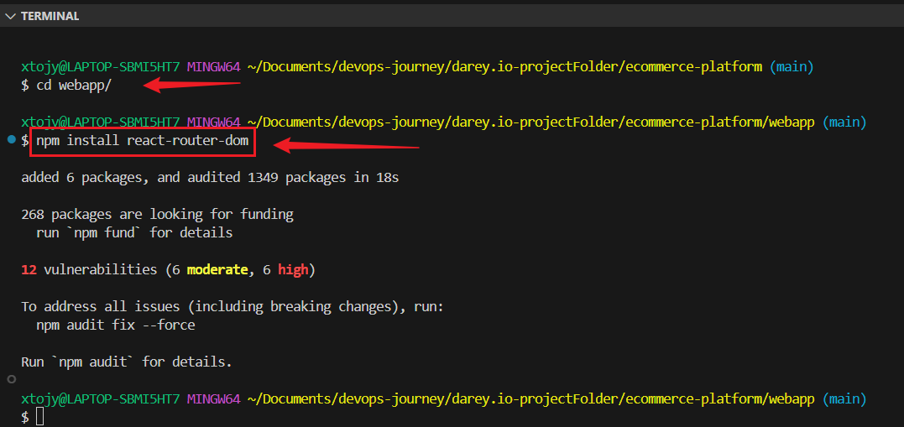

### 🔹4.2 Basic E-commerce Features
+ Modify src/App.js to include product listing:

```
import React from 'react';

function App() {
    return (
        <div>
            <h1>Welcome to E-commerce Platform</h1>
        </div>
    );
}

export default App;
```

+ Run the frontend locally and on Browser:
```
npm start
http://localhost:3000
```
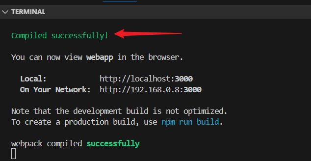
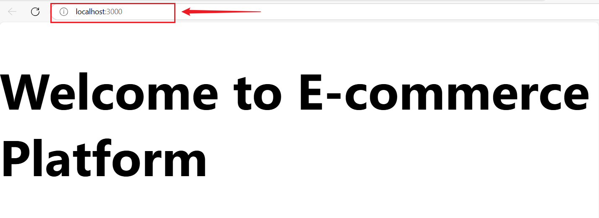


## 📌 Step 5️⃣: Continuous Integration Workflow

+ Create a CI workflow in .github/workflows/ci.yml

```
name: CI Pipeline

on: push

jobs:
  backend-tests:
    runs-on: ubuntu-latest
    steps:
      - uses: actions/checkout@v3
      - name: Set up Node.js
        uses: actions/setup-node@v3
        with:
          node-version: 22
      - name: Install dependencies
        run: |
          cd api
          npm install
      - name: Run tests
        run: |
          cd api
          npm test

  frontend-build:
    runs-on: ubuntu-latest
    steps:
      - uses: actions/checkout@v3
      - name: Set up Node.js
        uses: actions/setup-node@v3
        with:
          node-version: 22
      - name: Install dependencies
        run: |
          cd webapp
          npm install
      - name: Build application
        run: |
          cd webapp
          npm run build
```

+ ✅ Run Test 🧪
```
npm test
```

+ Commit and push the changes:
```
git add .
git commit -m "Initial project setup"
git push origin main
```


## 📌 Step 6️⃣: Docker Integration

+ **6.1 Create Dockerfiles**

+ Inside the (Backend) api folder, create a Dockerfile:
```
nano Dockerfile
```
```
FROM node:22-alpine
WORKDIR /app
COPY package.json package-lock.json ./
RUN npm install
COPY . .
CMD ["node", "index.js"]
EXPOSE 5000
```


+ Inside the (Frontend) webapp folder, create a Dockerfile:
```
FROM node:22
WORKDIR /app
COPY package.json .
RUN npm install
COPY . .
RUN npm run build
CMD ["npm", "start"]
EXPOSE 3000
```
## Step 7️⃣: ☁️ Deployment to Cloud using AWS EC2

+ I deployed my E-commerce platform (backend & frontend) on an AWS EC2 instance using Docker and GitHub Actions.

+ I used GitHub secrets to securely store and accessed cloud credentials.

```
name: Deploy to AWS EC2 with DockerHub

on:
  push:
    branches:
      - main  # Change to your deployment branch if different

jobs:
  deploy:
    runs-on: ubuntu-latest

    steps:
      - name: Checkout Code
        uses: actions/checkout@v3

      - name: Set up SSH
        uses: webfactory/ssh-agent@v0.5.3
        with:
          ssh-private-key: ${{ secrets.AWS_SSH_PRIVATE_KEY }}

      - name: Deploy to EC2
        run: |
          ssh -o StrictHostKeyChecking=no ubuntu@${{ secrets.EC2_HOST }} << 'EOF'
            echo "🔹 Connecting to EC2 Instance"

            # Authenticate DockerHub
            echo "${{ secrets.DOCKERHUB_PASSWORD }}" | docker login -u "${{ secrets.DOCKERHUB_USERNAME }}" --password-stdin

            # Pull latest backend API image
            echo "🚀 Pulling latest API image..."
            docker pull ${{ secrets.DOCKERHUB_USERNAME }}/ecommerce-api:latest

            # Stop and remove existing API container
            docker stop ecommerce-api || true
            docker rm ecommerce-api || true

            # Run API container
            echo "✅ Running new API container..."
            docker run -d --name ecommerce-api -p 5000:5000 ${{ secrets.DOCKERHUB_USERNAME }}/ecommerce-api:latest

            # Pull latest frontend web image
            echo "🚀 Pulling latest WebApp image..."
            docker pull ${{ secrets.DOCKERHUB_USERNAME }}/ecommerce-web:latest

            # Stop and remove existing WebApp container
            docker stop ecommerce-web || true
            docker rm ecommerce-web || true

            # Run WebApp container
            echo "✅ Running new WebApp container..."
            docker run -d --name ecommerce-web -p 3000:3000 ${{ secrets.DOCKERHUB_USERNAME }}/ecommerce-web:latest

            echo "🚀 Deployment Completed Successfully!"
          EOF
```

